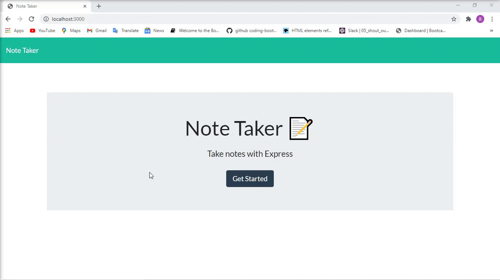

# Note-Taker

## Title:
Note Taker

## Description
This application can be used to write, save, and delete notes.

Github repository: https://github.com/decoste/Note-Taker

The following GIF demonstrates the application functionality:

## Installation
Heroku link: 

## Table of Contents
  * [Installation](#installation)
  * [Usage](#usage)
  * [Contributing](#contributing)
  * [Questions](#questions)
  * [License](#license)

## Usage
  TBD

## Contributing
If you would like to contribute, please check out the listed-below CONTRIBUTING file:
[CONTRIBUTING.md](./CONTRIBUTING.md)

## License
MIT license

## Questions
The following is my Github account:
[decoste](https://github.com/decoste)

Please feel free to send me an email if you have any question(s) aladecoste@gmail.com

Screenshot of the website:

